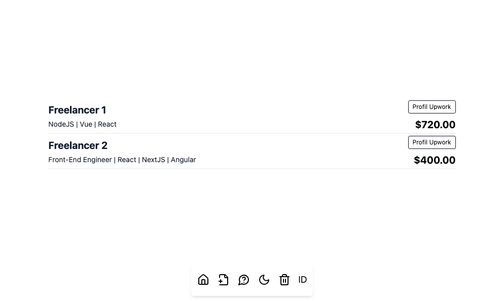
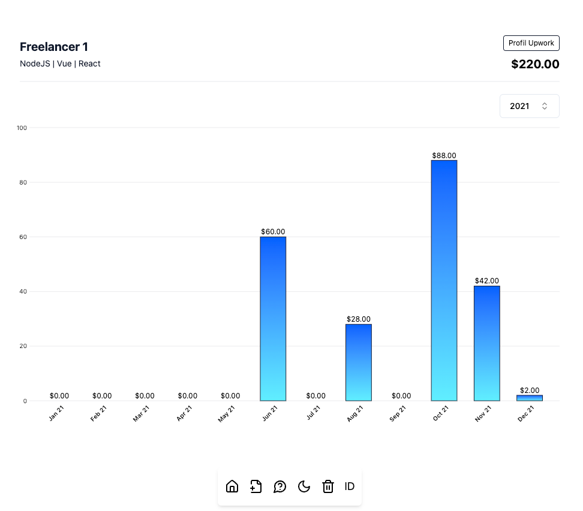

# Upwork

Mini application for displaying the Upwork's transactions to chart.

Wanna try? Here [Receh](https://upwork.ariefsn.dev).

## Images

  
Home

  

  
Freelancer

  

## Preparation

1. Get the Upwork ID

    > Go to profile page, and check the address bar, it will look like this: <https://www.upwork.com/freelancers/UPWORK_ID>.

2. Prepare the transactions report

    > Go to Transactions and Invoices page, choose the date range, then download as CSV.

## Run the app

1. [Manual](#manual)
2. [Docker](#docker)

### Manual

Please check the documentation of each services:

- [Backend](./backend/README.md)
- [Frontend](./frontend/README.md)

### Docker

1. Go to `compose` directory
2. Copy `.env.example` to `.env` and set the values
3. Run `docker compose up -d`
